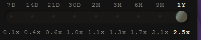

# Joining the Expedition

## Choose a Deity and enter Expedition.

**1. Select the Expedition tab of the Left Nav.**

********

**2. Choose COSMIC BULL or COSMIC BEAR.**

.png>).png>)

**3. Stake funds when Expedition Round Opens up to 60 seconds before round closes.**.png>)****

**4. The Amount Staked is your "BET" (but never at risk).**

**5. Your potential winnings amount is shown.**

****.png>)****

## Change your Deity:

**1. Open the Expedition tab from the Left Nav.**

**2. Click on the other Deity.**

**3. Confirm switch (May require transaction if funds already staked in the Expedition.)**

****.png>)****

**4. Hard Refresh (control + shift + r) to make sure the swap happened**

**5. After depositing funds hard refresh to make sure your deity is still your preferred choice - sometimes during deposit users switch their choice.**
