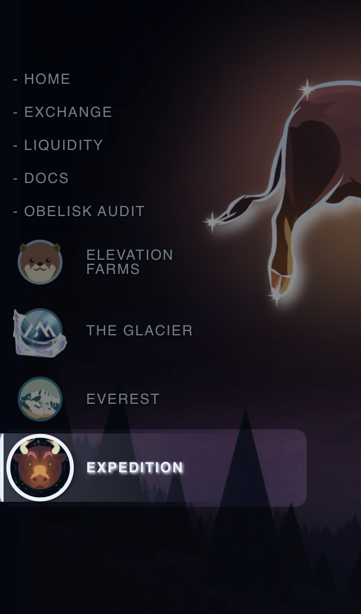

# Joining the Expedition fin

## Choose a Deity and enter Expedition.

**1. Select the Expedition tab of the Left Nav.**

**To deposit in an Expedition you must choose a Deity (think god-totem), take a look here for more information on Deities:**

**2. Choose COSMIC BULL or COSMIC BEAR.**

.png>)

Expeditions will now have a risk slider (your FAITH) allowing you to adjust your risk profile easily to take either a smaller guaranteed win or larger riskier wins with a higher chance of zero reward.

.png>)

**3. Freeze Summit to unlock Everest to participate in the Expedition**&#x20;

.png>)

****

**4. The Amount of Everest owned is your "BET" (but never at risk).**

**5. Your potential winnings amount is shown.  It is always in SUMMIT and USDC**

****

## Change your Deity:

**1. Open the Expedition tab from the Left Nav.**

**2. Click on the other Deity.**

**3. Confirm switch (May require transaction if funds already staked in the Expedition.)**

.png>)

**4. Hard Refresh (control + shift + r) to make sure the swap happened**

****
