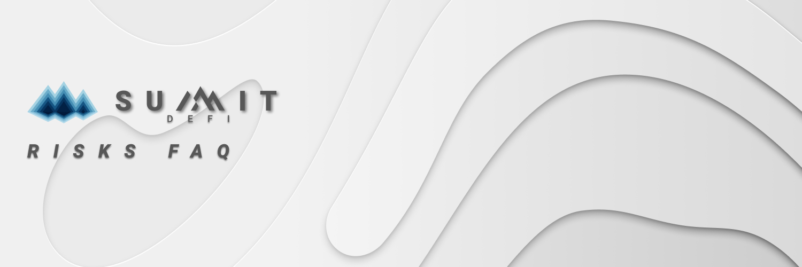

# Risks

## Can I lose my assets? 

The whole point of SUMMIT is that no one needs to lose. Everyone can win! So if you deposit assets in one of our pools you are taking a journey where all you risk is the loss of staking rewards, up to the level of risk you want to play for!  Your capital is never at risk.  &#x20;

And with your SUMMIT you get to benefit from EXPEDITION payouts every week as well! With no risk to your deposit.

The main ways you risk losing anything is if the DeFi product or platform SUMMIT is using to earn yield on collapses, or if  there is an issue with the pool that we are pass-through staking to.   But this is why we avoid risky DeFi products and accept lower yields in favor of the security that comes from working with proven partners and platforms.

## Can I lose my staked tokens?

Apart from the deposit fee - No. SUMMIT will never take your staked tokens from you. Your deposited tokens are always yours. No matter if you are a prize winner or not.  \

## What risks am I taking when staking on SUMMIT?

Nothing is entirely risk-free.  And that is especially true of Crypto.   We believe in safety and have made certain our smart contract is audited by a reputable organization.&#x20;

Our mission is to help you grow your assets, not lose them.  We avoid risky DeFi products and accept lower yields in favor of the security that comes from working with proven partners.

The only risks we can think of are: (1) if there is a bug or exploit in SUMMITs smart contracts that can be taken advantage of, or (2) if one of the DeFi products we’re using to earn interest for the platform has a problem or fundamental failure. We’ve worked hard to reduce these risks by (1a) having our code extensively audited by Obelisk, a third-party auditing service that specializes in smart contracts and (2) being very cautious about which partners and products we work with to earn interest. &#x20;

Additionally, there is an ongoing bug bounty live and running. You can find more about this in our Developer section within our Docs. &#x20;

## What can I lose?

Aside from the deposit fee, you can’t lose your deposit with SUMMIT.  We would hope the yield farming and pass through staking, and our eco system makes it a worthy trade-off to help grow your assets.

Interacting with our farms and expeditions requires transactions on the  blockchain, with cost and speed dependent on the network status and transaction complexity. &#x20;

This is still DeFi and an investment, and that brings risk.  Please be sure to never invest money you can’t afford to lose.

## What is the team ethos?

We’ve been around crypto for years, have invested, won, lost, and ~~cried~~ learned along the way.  We wanted to try and put our unique spin on DeFi.  We hope it succeeds, but if it doesn’t, we’re going down with the ship.&#x20;

We’ve paid for audits and have plans to grow, both to other blockchains and with more ideas.  To us, that is the pay off.  &#x20;

We hope to build trust and grow our project and offerings.  This is our declaration to the DeFi space that we’re here and we hope you like what we have to offer.  \

## How can I trust the winners are picked randomly?

Our code ensures the randomness, with a little help from our inbuilt random number generator, as audited by Obelisk.&#x20;


[random-number-generation](../farming/random-number-generation/)


## What’s the SUMMIT token distribution?

`Simple, fair, launch. `\

Depending on the blockchain, we plan on launching with a small amount of tokens, sold in a presale to help pay for audit and other launch expenses.  And that’s it.   The team will be buying tokens just like everyone else!
