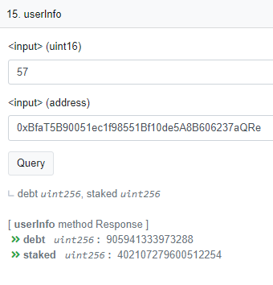
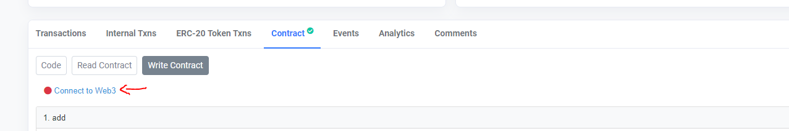
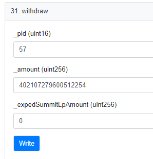

# Withdraw Through Contract

You are always able to withdraw your funds at any time. We have provided the below step-by-step process on how you can interact with the Smart Contract to do so should there ever be an issue with the website.** **

1. You need to get the Pool ID (PID) for the pool you are in. You can find this in the Pool ID section in our Documentation and then make note of it as we will use this later - [**https://docs.summitdefi.com/faq/pool-ids**](https://docs.summitdefi.com/faq/pool-ids)****

### Querying the Pool

1. Depending on the Elevation you are in will decide on which contract you will look it:
   1. **If you are in the OASIS, you will go to here: **[**https://ftmscan.com/address/0x68889c9d8e923b3e310B60ee588242A407fa6755#readContract**](https://ftmscan.com/address/0x68889c9d8e923b3e310B60ee588242A407fa6755#readContract)****
   2. **If you are in The Plains, The Mesa, or The Summit then you will go to here: **[**https://ftmscan.com/address/0xdE1e14e2ED8B2D883B8338b514dDc173e792271a#readContract**](https://ftmscan.com/address/0xdE1e14e2ED8B2D883B8338b514dDc173e792271a#readContract)****
2. Depending on which contract you are looking at you would need to do either of the following:
   * If you are looking at the **OASIS**, then you will scroll down in the "read contract" section to number **15** which is **userInfo**.&#x20;
     * For the **Elevation farms**, you will scroll down to number** 23**.
   * Here you will input the PID of the pool you are in that you got earlier and your address that holds funds in that pool.&#x20;
   * Input that info and then press the query button.
   * Make note of the **Staked **field as this is your amount staked in that pool and you will need that next.&#x20;
   * In the below Example, we are using PID 57 which is for wFTM in the Oasis.

### Withdrawing from the Pool

After having queried the pool in the previous steps, you can then proceed as follows.

* You then need to navigate to the **write **section within the cartographer contract. You can find this here  [**https://ftmscan.com/address/0x46d303b6829aDc7AC3217D92f71B1DbbE77eBBA2#writeContract**](https://ftmscan.com/address/0x46d303b6829aDc7AC3217D92f71B1DbbE77eBBA2#writeContract)****
* Connect your wallet to web3 so you can interact with it and once connected, the red button will turn green:

* Scroll down to number 31 and you will see the function called **Withdraw.**
* You will then input the PID for the pool you are trying to withdraw from and copy and paste the **Staked **figure you took from the previous query step.
* For the \_expedSummitLpAmount (uint256) you will input 0
* You will then click on the button **Write**

****

**Your wallet will then ask you to confirm the transaction. After confirming the transaction, your amount deposited in the farm for this asset will be withdrawn and then returned to your wallet.**

You can repeat this for each asset you have in your pools.
