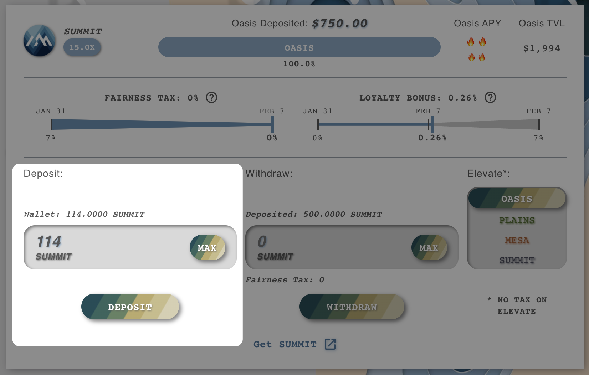

# How to: Elevation Farm

Yield Multiplying is a two step process:

1. Select a Totem ([**covered here**](../totem/selecting-totem.md)).
2. Stake with an Elevation farm.

This guide will assume that you have already [selected a totem](../totem/selecting-totem.md), and are ready to stake in an **Elevation farm**.

## Staking in an Elevation Farm

* **Select an Elevation (PLAINS / MESA / SUMMIT) from the left nav:**

* **Click the Elevation Farm you wish to stake with in a similar way you would have done to join an Oasis pool (Select pool, Approve it and then Deposit it):**

