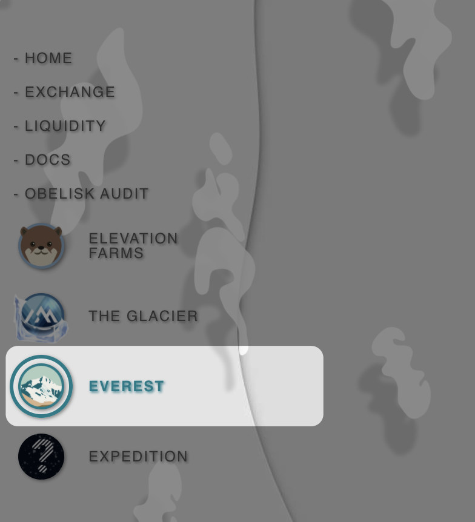

# Locking Summit For Everest

Apart from directly locking SUMMIT through the Glacier tab&#x20;


[vesting-and-harvesting.md](vesting-and-harvesting.md)


You can also lock SUMMIT for EVEREST via the below steps:

* Choose EVEREST from the left side UI

* **Choose how much SUMMIT and how long you want to lock it for (longer the lock the more EVEREST)**

* **Choose "Increase Locked Summit" (if you already have summit locked) or "Lock Summit" (if you have no summit locked)**&#x20;

<mark style="color:red;">**EVEREST much be returned at the end of the lock period to unlock your SUMMIT.**</mark>
