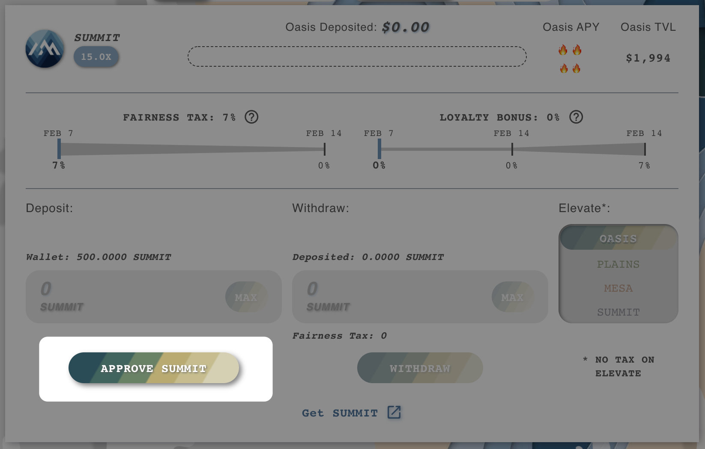
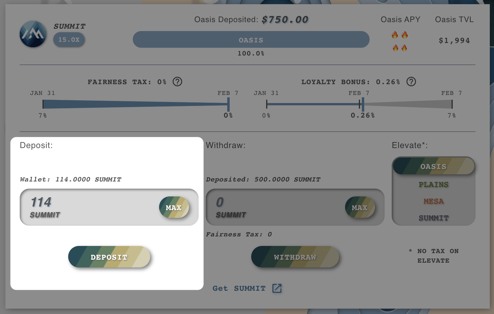

# Oasis Farms


**The OASIS is functionally equivalent to standard yield farming projects, stake tokens / LP, earn SUMMIT.**&#x20;

**How the OASIS fits into the overall Summit DeFi ecosystem, and your strategy, is for you to explore.**


The OASIS is the safest elevation to farm at, with guaranteed yield and only a single totem:

.png>)

The Otter oversees all funds at the OASIS, and doesn't need to compete against any other totem. He protects your yield and ensures that you get to harvest it.

## As Part of a Healthy Balanced ~~Breakfast~~ Risk Profile

Higher elevations may offer more _potential_ rewards, and may hit that over a long enough time span, but the OASIS will earn guaranteed rewards that can be harvested at any time.

By mixing your investment amounts between Elevations, you can ensure that your farming setup matches your risk tolerance. If you want to take absolutely 0 risk, you are welcome to farm 100% at the OASIS, and if you slide a little further into risk tolerance you can try your luck at the higher elevations.

## How To: Farm at the OASIS

* **Select Elevation Farms from the left nav:**\

* **Select OASIS from the top nav**

* **Select the OASIS farm you** **wish to join and press "Approve" if not previously done so:**

* **Deposit your Tokens / LP and begin earning:**

\
