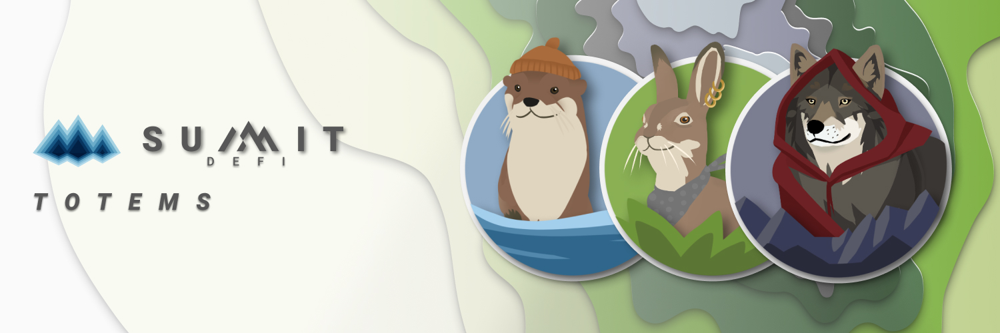

# Totems

## **What are Totems?**

Totems represent collections of staked funds in the farms. You can imagine your Totem sitting down at a poker table trying to win you money.

A single Totem represents you across an elevation, and all your funds will be staked with that totem.

## **What choosing a Totem means?**

Not only is your Totem responsible for your success or failure across an entire elevation, but you are never alone.

Even at the highest elevation, each totem will have hundreds of users standing behind it hoping for its success.

**Find the others out there that share your totem.  
You will all win together,  
and you will all lose together.**

## **Which totem is right for you?**

1. You can choose whichever is cutest.
2. You can look at the historical winners to try and find the luckiest.
3. You can look at the volume staked for each totem in a farm you want to enter, and decide based on that
4. I can't stress this enough, you can choose whichever is cutest.

