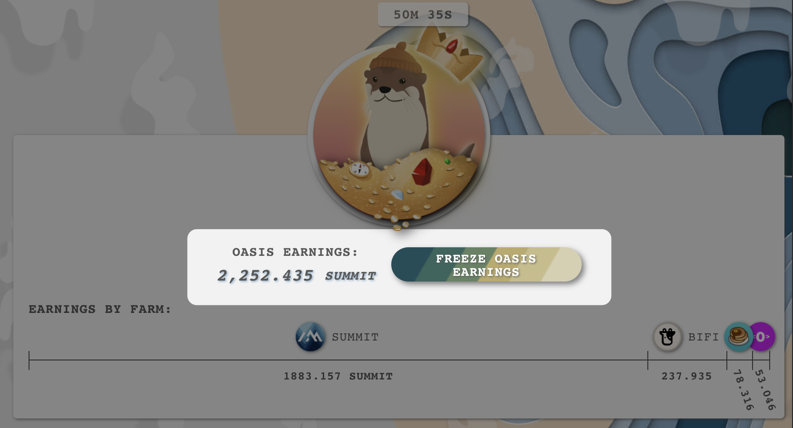
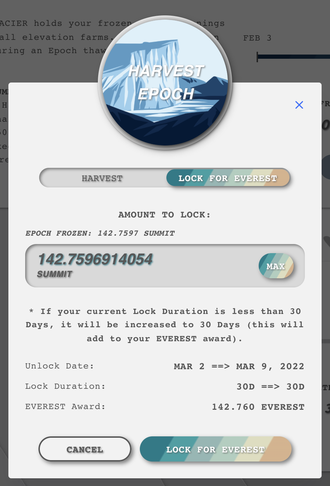

# Yield Locking & Glacier Harvesting


**Freezing requires your winnings to mature before you can withdraw them without penalty.**

**Winnings Vest over 28 - 35 days following being moved to the Glacier**


## Why do we use Yield Locking(Freezing)?

To reward loyal Summit holders, to incentivise long term investors, and to disincentives short term thinking with regards to our farms we have introduced yield locking.  We recognise the benefits yield locking has had for other projects to develop their community and wider use of their token, and we hope that it will similarly help the Summit project and support more stable price action (but you never know with whales...)

## What Yield Locking (Freezing) is there?

We have added Yield Locking on farmed rewards which require 28 - 35 days to mature to become 100% claimable with zero penalty (once they have been Frozen in the Glacier).&#x20;

You can claim rewards early before the lock matures however this will incur a 50% penalty on the claimed amount. Of this taxed amount half is sent to the Expedition again to reward SUMMIT holders and the remainder is burned reducing SUMMIT supply.

You can also lock your Frozen Summit for EVEREST at no penalty, as long as it is locked for 30 days or more.  If it is locked for less than 30 days the Everest lock period will be pushed to a minimum of 30 days. &#x20;

## Harvesting Winnings

*   **Wait for some (or all) of your yield farming tokens to generate Summit Earnings then use the `Freeze`button to freeze (move) this earnings to the Glacier:**

    ***

* **Use the Harvest Epoch button to harvest thawed (unlocked) Summit, harvest early (at 50% tax), or Lock  in Everest**&#x20;

****

***
