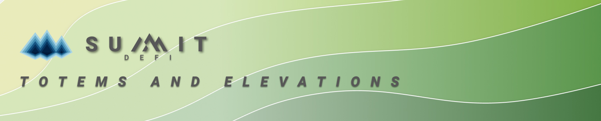

# Totems and Elevations

## TOTEMS - What are these adorable creatures and why should I care?

Totems are your champions of the Elevation Farms, they are working hard to make sure you win big and boost your SUMMIT yields. They battle 24/7, for your yields, so show them some support!

You will have a unique totem for each elevation you stake in. All farms at an elevation will share your Totem, so choose wisely! Although if you do feel like your totem is no longer for you, then you're able to kick it to the curb and pick yourself a new one. No hard feelings. Apart from the one you kicked to the curb. 



## ELEVATION FARMS - Yield gamble to earn big

Elevation Farms are round based farms where you risk your accrued SUMMIT yields. We have created 3 elevations for you to explore, each with different risk-reward profiles. Each Elevation features a unique roster of Totems, and you will pick only one to be your champion.

Here is breakdown of key details for each of the elevations \(including OASIS for comparison\):

<table>
  <thead>
    <tr>
      <th style="text-align:left">Elevation</th>
      <th style="text-align:left">
        
Number of

        
Totems

      </th>
      <th style="text-align:left">
        
Round

        
Duration

      </th>
      <th style="text-align:left">
        
Chance of

        
Win

      </th>
      <th style="text-align:left">
        
Multiplier on Win

        
(est)

      </th>
      <th style="text-align:left">
        
Allocation

        
Boost

      </th>
    </tr>
  </thead>
  <tbody>
    <tr>
      <td style="text-align:left"><b>The OASIS</b>
      </td>
      <td style="text-align:left">n/a</td>
      <td style="text-align:left">n/a</td>
      <td style="text-align:left">100%</td>
      <td style="text-align:left">n/a</td>
      <td style="text-align:left">100%</td>
    </tr>
    <tr>
      <td style="text-align:left"><b>The PLAINS</b>
      </td>
      <td style="text-align:left">2</td>
      <td style="text-align:left">2 hours</td>
      <td style="text-align:left">50%</td>
      <td style="text-align:left"><b>2X</b>
      </td>
      <td style="text-align:left">110%</td>
    </tr>
    <tr>
      <td style="text-align:left"><b>The MESA</b>
      </td>
      <td style="text-align:left">5</td>
      <td style="text-align:left">4 hours</td>
      <td style="text-align:left">20%</td>
      <td style="text-align:left"><b>5X</b>
      </td>
      <td style="text-align:left">125%</td>
    </tr>
    <tr>
      <td style="text-align:left"><b>The SUMMIT</b>
      </td>
      <td style="text-align:left"><b>10</b>
      </td>
      <td style="text-align:left">8 hours</td>
      <td style="text-align:left">10%</td>
      <td style="text-align:left"><b>10X</b>
      </td>
      <td style="text-align:left">150%</td>
    </tr>
  </tbody>
</table>

### How to Elevation Farm

1. Select your totem for an elevation.
2. Stake tokens / LP in an elevation farm.
3. Accumulate yield to gamble over duration of round.
4. Wait for round to rollover to see if you win or lose.
5. If  you **win:** wait for your SUMMIT winnings to vest, and harvest at will.

To see screenshots of the elevation farming process, see the in depth pages on [**how to select a totem**](../farming/totem/selecting-totem.md) and ****[**how to yield multiply**](../farming/elevation/how-to.md).

### Mathematically Guaranteed

Elevation farms are **guaranteed** to earn more SUMMIT rewards than corresponding OASIS farms, due to the **allocation boost** they get by default. Higher elevations are given a much higher allocation boost, but the chance of winning is lower at higher elevation, so it may take longer for the RNG to play out in your favor.

As an example, The PLAINS features 2 totems, each with a 50% chance of win. After only two rounds staked in the plains, you would expect one win and one loss. Averaging out over time **and** with the allocation boost included, you will have won 10% more SUMMIT than the corresponding OASIS farm.

For more information on the **allocation boost**, or elevation farming in general, take a look here:



