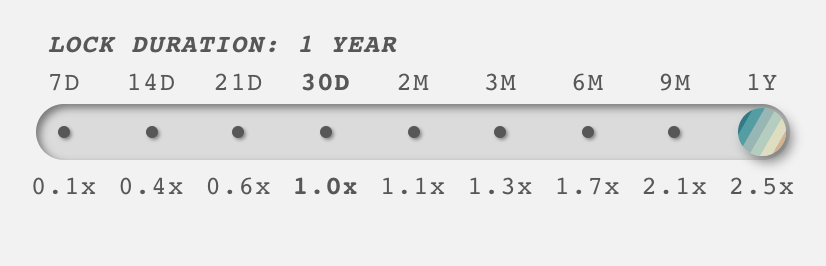

# Everest

## **What is Everest**

Everest will be the Summit DeFi governance token, with some extra bonuses.  Apart from helping with the future direction of Summit DeFi (through queries from the team which Everest holders can vote on), Everest can be used in the following ways:

* You can either use it to farm more Summit through our Yield Multiplying platform
* Automatically participate in Expeditions!
* Join exclusive Everest Pools, which use part of the Expedition Treasury to consistently earn you tokens (To be implemented)

### What about joining the Expeditions?

While your SUMMIT is locked for EVEREST, you are automatically entered into the daily Expedition drawings, where you earn a portion of that Expeditions pot if your Deity wins the drawing though make sure to select your Deity for the first time!

### **How do I earn Everest?**

You earn Everest by locking your SUMMIT.  Depending on how long you lock your SUMMIT will also give you an increased earning factor for Everest in line with the below slider

As an example, if you lock your SUMMIT in for 30  day, it will earn 1x Everest however; if you lock your SUMMIT for a year, it will earn a higher amount of 2.5 Everest. \
\
At the end of the lock period, you will need your Everest to redeem your initial SUMMIT about locked up.

How to earn Everest is covered in:


[vesting-and-harvesting.md](../farming/vesting-and-harvesting.md)



[locking-summit-for-everest.md](../farming/locking-summit-for-everest.md)


