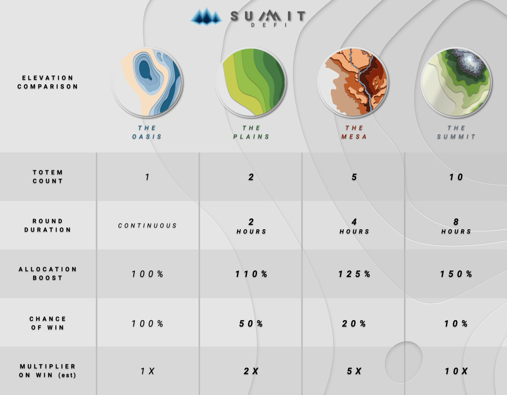

# Yield Multiplying By Example


The fabled battle takes place on the PLAINS. Let the Tortoise and Hare teach you about the cornerstone of Summit DeFi:

**Yield Multiplying**


## What is Yield Multiplying?

When users stake in an Elevation Farm (The PLAINS, The MESA, and The SUMMIT), they generate yield (in SUMMIT token). The amount of SUMMIT generated is based on the emissions / apr of the farm, just like a traditional yield farm.

Unlike a traditional yield farm, this SUMMIT is not immediately available for harvesting. Instead, over the duration of a round, it accumulates and is contributed to a Totem (think of like a Team). At the end of the round, a single totem is randomly picked to be the winner, and the user's who have selected that winning totem are granted a **Yield Multiplier** against the yield that they contributed during the round.

When the Totems compete, they only compete with the Yield Generated during a round. The amount you stake is always safe, and always yours. As the saying goes

#### _**"Risk the Milk, not the Cow"**_

The example below explains what **Yield Multiplying** will feel like in practice.&#x20;

## Example:

### The Setup

The PLAINS has two Totems: The Hare, and The Tortoise

The PLAINS has 2 hour rounds.

### Staking

2 users, both stake in the SUMMIT farm, and both have chosen the Hareas their Totem.

User 1 stakes 100 SUMMIT, and leaves it in for the full 2 hour duration. **User 1's 100 SUMMIT generates 10 SUMMIT yield over the 2 hour round. **

User 2 stakes 1000 SUMMIT, but only leaves it in for 30 minutes. **User 2's 1000 SUMMIT generates 30 SUMMIT yield over the 30 minutes the user was staked in the farm** (this is a higher yield, even though User 2 staked for less time, because they staked more SUMMIT, just like a traditional Yield farm).&#x20;

### Rewards

Between these 2 users, the Hare  would be holding a total of 40 SUMMIT yield when the round ends. Lets also say at the end of the round, the Tortoise  has generated 50 SUMMIT yield from users 3, 4, and 5 who have been earning and contributing their own yield over the duration of the round.&#x20;

**This means that the total "pot" for the round is 90 SUMMIT. **

If the Hare  is randomly selected as the winning Totem, then the **"yield multiplier"** for all the users of the  is calculated to be **2.25X **(90 SUMMIT total / 40 SUMMIT of ).

This **multiplier** is applied to each SUMMIT yield that is generated by users 1 and 2, so the final rewards for each users is as follows:

_User 1_: 10 SUMMIT yield put into the round \* **2.25X** multiplier = **22.5** SUMMIT rewards

_User 2_: 30 SUMMIT yield put into the round \* **2.25X** multiplier = **67.5** SUMMIT rewards

_Users 3/4/5_: The  didn't win the round, so they didn't win any SUMMIT rewards

**As you can see, the amount of rewards each User earns at the end of the round is based on how much yield each user generates and contributes to their Totem, as well as the comparative yield between the two Totems of the PLAINS (**** and ****)**

## **Elevations Comparison**

**For more information on Yield Multiplying and its intricacies, take a look at the full explanation below:**


[elevation](farming/elevation/)

